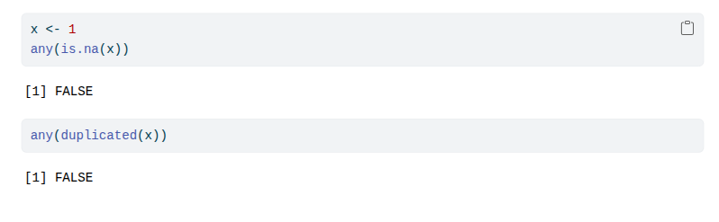

---
format:
  typst:
    keep-typ: true
    syntax-highlighting: idiomatic
    include-before-body:
      - text: |
          #import "../index.typ": template, tufted
          #import "@preview/lilaq:0.5.0" as lq
          // 如需生成 RSS feed，必须填写 title、description 和 date 元数据
          #show: template.with(
            title: "Jarl 0.5.0",
            date: datetime(year: 2026, month: 03, day: 23),
            lang: "en",
          )
---

# Jarl 0.5.0

I'm glad to announce the release of [Jarl](https://jarl.etiennebacher.com/) 0.5.0.
Jarl is a very fast R linter, written in Rust.
It finds inefficient, hard-to-read, and suspicious patterns of R code across dozens of files and thousands of lines of code in milliseconds.
Install or update Jarl [via the command line](https://jarl.etiennebacher.com/#installation) or install the [Jarl extension](https://jarl.etiennebacher.com/howto/editors) in Positron, VS Code, Zed, and more.

This release comes with many new features and some bug fixes and deprecations.

## Check R Markdown and Quarto documents

Jarl now checks R Markdown and Quarto documents by default, in addition to R files. 
More specifically, it checks the content of R code chunks in `.Rmd`, `.rmd`, and `.qmd` files:

````{.r filename="test.Rmd"}
---
title: "hello"
---

```{{r}}
x <- 1
any(is.na(x))
```
````

```
$ jarl check test.Rmd
warning: any_is_na
 --> test.Rmd:7:1
  |
7 | any(is.na(x))
  | ------------- `any(is.na(...))` is inefficient.
  |
  = help: Use `anyNA(...)` instead.
```

This new functionality also comes with a new suppression comment: `jarl-ignore-chunk`.
Other suppression comments still work, but `jarl-ignore-chunk` will be parsed as a chunk option and therefore will not appear in the rendered output:

````default
---
title: "hello"
---

```{{r}}
#| jarl-ignore-chunk:
#|   - any_is_na: this is just a demo
#|   - any_duplicated: another reason to suppress this violation
x <- 1
any(is.na(x))
any(duplicated(x))
```
````

{fig-alt="A screenshot of the HTML output produced by the R Mardown example above. It shows that the two calls to `any()` return `FALSE`, but importantly the `jarl-ignore-chunk` comments do not appear in the output."}

See more information in the ["Suppression comments" docs](https://jarl.etiennebacher.com/howto/suppression-comments#where-should-i-place-suppression-comments).

## Rule-specific options in `jarl.toml`

It is now possible to pass options for specific rules in the config file. 
This can be useful in two situations:

- respect the user preferences for rules that don't have a clear argument in favor of one side or another (e.g. `<-` vs `=`, or `"` vs `'`);
- give more information to Jarl, for instance for the `unreachable_code` rule (see example below).

Those rules can be customized with a `[lint.<rule-name>]` section in `jarl.toml`.
For example, `unreachable_code` (introduced in the previous version of Jarl) detects code that would never run because it comes after a `stop()` (among other situations).
This rule already comes with a bundled list of "stopping functions", such as `rlang::abort()`.
However, maybe you have defined your own custom stopping function that Jarl doesn't know, e.g. `stopf()` in `data.table`:

```{r}
#| jarl-ignore-chunk:
#|   - internal_function: it's a demo
data.table:::stopf
```

As of Jarl 0.5.0, someone working on the `data.table` project could now add the following in `jarl.toml`:

```toml
[lint.unreachable_code]
extend-stopping-functions = ["stopf"]
```

This would add `stopf()` on top of all the other stopping functions.
Use `stopping-functions` instead to define the entire list by yourself.

See all rule-specific options in the ["Configuration file" docs](https://jarl.etiennebacher.com/reference/config-file#rule-specific-arguments).

## Allow multiple `jarl.toml`

Until now, Jarl would allow a single `jarl.toml` in the project to check.
This means that it would error if you were running Jarl on the folder `my_projects` containing several R packages or other projects, each with their own `jarl.toml`.

Jarl now allows this, meaning that each analyzed file will use the closest `jarl.toml` that exists in the same folder or in a parent folder.

For example, let's say I have the following folders that belong to a more general "projects" folder:
```
projects
  ├── mypkg1
  │   ├── DESCRIPTION
  │   ├── jarl.toml
  │   ├── NAMESPACE
  │   └── R
  │       └── foo1.R
  └── mypkg2
      ├── DESCRIPTION
      ├── jarl.toml
      ├── NAMESPACE
      └── R
          └── foo2.R
```
Both `mypkg1/R/foo1.R` and `mypkg2/R/foo2.R` contain the following code:

```r
any(is.na(x))
any(duplicated(x))
```

`mypkg1/jarl.toml` selects *only* the `any_is_na` rule, and `mypkg2/jarl.toml` selects *only* the `any_duplicated` rule.

This would error^[Even worse than that, it would *panic*! This is what happens in Rust when you don't properly handle errors.] with Jarl 0.4.0:

```
$ jarl check mypkg1 mypkg2

thread 'main' (1044252) panicked at crates/jarl-core/src/config.rs:96:9:
not yet implemented: Don't know how to handle multiple TOML
note: run with `RUST_BACKTRACE=1` environment variable to display a backtrace
```
but it works just fine with Jarl 0.5.0:

```
$ jarl check mypkg1 mypkg2

warning: any_is_na
 --> mypkg1/R/foo1.R:1:1
  |
1 | any(is.na(x))
  | ^^^^^^^^^^^^^ `any(is.na(...))` is inefficient.
  |
help: Use `anyNA(...)` instead.

warning: any_duplicated
 --> mypkg2/R/foo2.R:2:1
  |
2 | any(duplicated(x))
  | ^^^^^^^^^^^^^^^^^^ `any(duplicated(...))` is inefficient.
  |
help: Use `anyDuplicated(...) > 0` instead.


── Summary ──────────────────────────────────────
Found 2 errors.
2 fixable with the `--fix` option.
```


## Package-specific rules

So far, Jarl's rules were mostly copied from [`lintr`'s list](https://lintr.r-lib.org/dev/reference/index.html).
Most of those rules focus on base R or other concerns (e.g. which assignment operator to prefer in the project).

As of 0.5.0, Jarl opens the door to package-specific rules.
Those rules apply to functions from particular packages, such as `dplyr::filter()`, and they come with a performance tradeoff.
The problem here comes from two components:

1. a given function, say `filter()`, can be exported by several packages:

    ``` r
    pkgcheck::fn_names_on_cran("filter")
    #>          package version fn_name
    #> 1         crunch  1.31.1  filter
    #> 2        gsignal   0.3-7  filter
    #> 3         narray   0.5.2  filter
    #> 4  pandocfilters   0.1-6  filter
    #> 5        poorman   0.2.7  filter
    #> 6           rTLS 0.2.6.1  filter
    #> 7         signal   1.8-1  filter
    #> 8         tidyft  0.9.20  filter
    #> 9        tidylog   1.1.0  filter
    #> 10     tidytable  0.11.2  filter
    #> 11         dplyr   1.2.0  filter
    #> 12           rbi   1.0.1  filter
    #> 13     pammtools   0.7.4  filter
    #> 14 cohortBuilder   0.4.0  filter
    #> 15         stats   4.5.2  filter
    ```

1. Jarl does static analysis, meaning that it doesn't run R code.

To enable package-specific rules, the latter has to be slightly relaxed.
Jarl will run R to get the version and list of exports of all packages used in the session, and this introduces a slight slowdown when any of those package-specific rules are enabled.
However, Jarl should still run in less than 1 second on your entire project.
Note that if you enable these rules and use Jarl in CI, you will need to adapt your workflow to install R and the dependencies of your project as well.

So far, Jarl provides only two package-specific rules, both for `dplyr`:

* `dplyr_group_by_ungroup` looks for chains of pipes that could be replaced by the argument `.by` or `by`, e.g.:

   ```r
   library(dplyr)
   mtcars |> 
     group_by(am, cyl) |> 
     summarize(mean_mpg = mean(mpg)) |> 
     ungroup()
   ``` 
   ```
   warning: dplyr_group_by_ungroup
   --> test.R:4:3
     |
   4 | /   group_by(am, cyl) |> 
   5 | |   summarize(mean_mpg = mean(mpg)) |> 
   6 | |   ungroup()
     | |___________- `group_by()` followed by `summarize()` and `ungroup()` can be simplified.
     |
     = help: Use `summarize(..., .by = c(am, cyl))` instead.

   ── Summary ──────────────────────────────────────
   Found 1 error.
   1 fixable with the `--fix` option.
   ```

   Note that this would only be reported if your `dplyr` version is `>= 1.1.0`. 

* `dplyr_filter_out` looks for `x |> filter(...)` with conditions such as `my_condition(var) | is.na(var)`. As of `dplyr` 1.2.0, these `filter()` calls can be replaced with easier-to-read `filter_out()` calls:

   ```r
   library(dplyr)
   mtcars |> 
     group_by(am, cyl) |> 
     summarize(mean_mpg = mean(mpg)) |> 
     ungroup()
   ``` 
   ```
   warning: dplyr_filter_out
   --> test.R:3:3
     |
   3 |   filter(hair_color != "blond" | is.na(hair_color))
     |   ------------------------------------------------- This `filter()` contains complex condition(s).
     |
     = help: It can be simplified by using `filter_out()`, which keeps `NA` rows.


   ── Summary ──────────────────────────────────────
   Found 1 error.
   1 fixable with the `--fix` option.
   ```

See the [package-specific rules](https://jarl.etiennebacher.com/howto/package-specific) section in the docs for more details.

## Other features for package developers

This release brings a couple of enhancements for R package developers.

First, Jarl comes with two new rules that run in R packages only: `unused_function` and `duplicated_function_definition`.
The former finds functions that are not used anywhere (in other functions or in tests) and are not exported by the package, meaning that they should either be fixed or removed.
The latter finds functions that are defined several times in the package, leading to one definition being used and the other(s) being ignored by mistake.

Second, Jarl now checks `roxygen2` comments by default and reports violations in `@examples` and `@examplesIf`.
Diagnostics reported in those comments can be ignored with standard suppression comments:

```r
#' @examples
# jarl-ignore any_is_na: <reason>
#' any(is.na(x))
```

Note that `jarl-ignore` starts with `#` and not `#'`.

This feature can be controlled with two new arguments in `jarl.toml`: `check-roxygen` (true by default) and `fix-roxygen` (false by default because some formatters such as Air cannot format roxygen comments yet).

## Conclusion

Jarl 0.5.0 brings many exciting features, try them out!
If you find any issue, have feature ideas, or want to contribute, head to the [Github repository](https://github.com/etiennebacher/jarl).

Thanks to everyone who contributed one way or another to this release: [\@bjyberg](https://github.com/bjyberg), [\@larry77](https://github.com/larry77), [\@maelle](https://github.com/maelle), [\@novica](https://github.com/novica), and [\@vincentarelbundock](https://github.com/vincentarelbundock)

<!-- 
x <- gh::gh(
  "/repos/:owner/:repo/issues",
  owner = "etiennebacher",
  repo = "jarl",
  since = "2026-02-06",
  state = "closed",
  .limit = Inf
)
users <- sort(unique(purrr::map_chr(x, c("user", "login"))))
users <- grep("dependabot", users, invert = TRUE, value = TRUE)
users <- grep("etiennebacher", users, invert = TRUE, value = TRUE)
clipr::write_clip(glue::glue_collapse(
  glue::glue("[\\@{users}](https://github.com/{users})"),
  ", ",
  last = ", and "
))
-->
